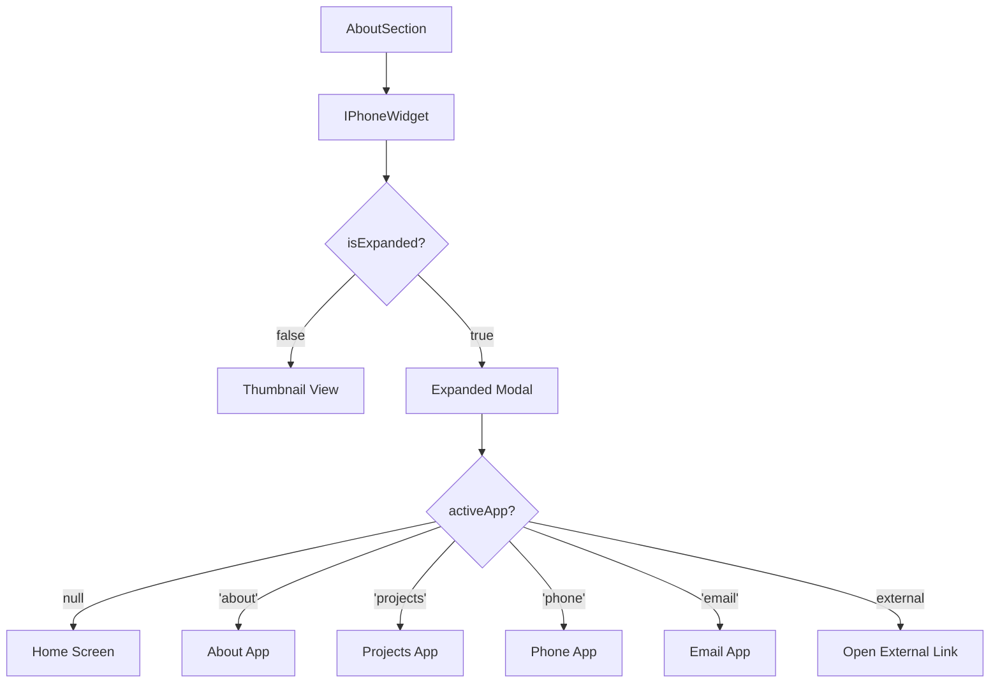

# Design Document

## Overview

The Interactive iPhone Widget is a sophisticated UI component that replaces the Skills section in the About page. It provides an immersive, realistic iPhone interface where users can interact with portfolio content through a mobile-first experience. The component leverages glassmorphism design principles, smooth animations, and realistic iOS-style interactions to create a memorable user experience.

The widget consists of three main states:

1. **Thumbnail State**: Compact iPhone display in the About section
2. **Expanded State**: Fullscreen modal with interactive Home Screen
3. **App State**: Individual app views within the expanded iPhone

## Architecture

### Component Hierarchy

```
AboutSection
└── IPhoneWidget
    ├── IPhoneFrame (visual container)
    │   ├── SystemBar (time, date, status icons)
    │   ├── HomeScreen (app grid)
    │   │   └── AppIcon[] (individual app icons)
    │   └── AppContainer (modal for opened apps)
    │       ├── AboutApp
    │       ├── ProjectsApp
    │       ├── ResumeApp
    │       ├── PhoneApp
    │       ├── EmailApp
    │       └── ExternalLinkApp
    └── ModalBackdrop (overlay when expanded)
```

### State Management

The component uses React state and context for managing:

- **Expansion state**: `isExpanded` (boolean)
- **Active app**: `activeApp` (string | null)
- **System time**: `currentTime` (Date)
- **Form data**: For email and phone apps

### Data Flow



## Components and Interfaces

### 1. IPhoneWidget Component

**Purpose**: Main container component that manages state and orchestrates the iPhone experience

**Props**:

```typescript
interface IPhoneWidgetProps {
  personalInfo: PersonalInfo;
  projects: Project[];
  resumeUrl?: string;
  githubUrl: string;
  linkedinUrl: string;
  className?: string;
}

interface PersonalInfo {
  name: string;
  title: string;
  bio: string;
  phone: string;
  email: string;
  location: string;
}
```

**State**:

```typescript
interface IPhoneWidgetState {
  isExpanded: boolean;
  activeApp: AppType | null;
  currentTime: Date;
}

type AppType =
  | 'about'
  | 'projects'
  | 'resume'
  | 'phone'
  | 'email'
  | 'github'
  | 'linkedin';
```

**Key Methods**:

- `handleExpand()`: Expands iPhone to fullscreen modal
- `handleCollapse()`: Collapses iPhone back to thumbnail
- `handleAppClick(appType: AppType)`: Opens specific app
- `handleAppClose()`: Returns to Home Screen
- `updateTime()`: Updates system time every minute

### 2. IPhoneFrame Component

**Purpose**: Renders the physical iPhone frame with realistic styling

**Props**:

```typescript
interface IPhoneFrameProps {
  isExpanded: boolean;
  children: React.ReactNode;
  onClick?: () => void;
  className?: string;
}
```

**Styling Features**:

- Realistic iPhone 14 Pro dimensions (393x852px logical)
- Rounded corners with notch cutout
- Metallic frame border
- Screen bezel with subtle shadow
- Dynamic island area (decorative)
- Glass screen effect with reflection

**CSS Structure**:

```css
.iphoneFrame {
  /* iPhone 14 Pro aspect ratio */
  aspect-ratio: 393 / 852;
  border-radius: 55px;
  background: linear-gradient(145deg, #1a1a1a, #2d2d2d);
  box-shadow:
    0 0 0 12px #1a1a1a,
    0 0 0 14px #3a3a3a,
    0 20px 60px rgba(0, 0, 0, 0.5);
  position: relative;
  overflow: hidden;
}

.screen {
  position: absolute;
  inset: 14px;
  border-radius: 45px;
  background: #000;
  overflow: hidden;
}
```

### 3. SystemBar Component

**Purpose**: Displays iOS-style system information at the top of the screen

**Props**:

```typescript
interface SystemBarProps {
  currentTime: Date;
  showNotch?: boolean;
}
```

**Features**:

- Real-time clock (HH:MM format)
- Current day and date
- Status icons (signal, WiFi, battery)
- Dynamic Island integration
- Glassmorphism background

**Layout**:

```
┌─────────────────────────────────┐
│  9:41  Mon, Nov 8  [●●●] 100% ⚡│
└─────────────────────────────────┘
```

### 4. HomeScreen Component

**Purpose**: Displays the grid of app icons with iOS-style layout

**Props**:

```typescript
interface HomeScreenProps {
  onAppClick: (appType: AppType) => void;
  apps: AppConfig[];
}

interface AppConfig {
  id: AppType | string;
  name: string;
  icon: React.ReactNode | string;
  color: string;
  functional: boolean;
  externalUrl?: string;
}
```

**Layout**:

- 4 columns × 6 rows grid
- 16px gap between icons
- Bottom dock with 4 frequently used apps
- Page indicator dots
- Glassmorphism background with wallpaper

**App Grid Configuration**:

```typescript
const APPS: AppConfig[] = [
  // Row 1
  { id: 'about', name: 'About', icon: <User />, color: '#007AFF', functional: true },
  { id: 'projects', name: 'Projects', icon: <Briefcase />, color: '#5856D6', functional: true },
  { id: 'resume', name: 'Resume', icon: <FileText />, color: '#FF9500', functional: true },
  { id: 'github', name: 'GitHub', icon: <Github />, color: '#000000', functional: true },

  // Row 2
  { id: 'linkedin', name: 'LinkedIn', icon: <Linkedin />, color: '#0A66C2', functional: true },
  { id: 'phone', name: 'Phone', icon: <Phone />, color: '#34C759', functional: true },
  { id: 'email', name: 'Mail', icon: <Mail />, color: '#007AFF', functional: true },
  { id: 'youtube', name: 'YouTube', icon: <Youtube />, color: '#FF0000', functional: false },

  // Row 3
  { id: 'safari', name: 'Safari', icon: <Compass />, color: '#007AFF', functional: false },
  { id: 'photos', name: 'Photos', icon: <Image />, color: '#FF3B30', functional: false },
  { id: 'camera', name: 'Camera', icon: <Camera />, color: '#8E8E93', functional: false },
  { id: 'settings', name: 'Settings', icon: <Settings />, color: '#8E8E93', functional: false },

  // Additional decorative apps...
];
```

### 5. AppIcon Component

**Purpose**: Individual app icon with iOS-style appearance and interactions

**Props**:

```typescript
interface AppIconProps {
  app: AppConfig;
  onClick: () => void;
  size?: 'normal' | 'dock';
}
```

**Features**:

- Rounded square shape (iOS style)
- Gradient background based on app color
- Icon centered with proper sizing
- App name label below icon
- Press animation on click
- Glassmorphism overlay
- Badge support (optional)

**Styling**:

```css
.appIcon {
  width: 60px;
  height: 60px;
  border-radius: 13px;
  background: linear-gradient(135deg, var(--app-color), var(--app-color-dark));
  box-shadow:
    0 2px 8px rgba(0, 0, 0, 0.3),
    inset 0 1px 0 rgba(255, 255, 255, 0.2);
  display: flex;
  align-items: center;
  justify-content: center;
  cursor: pointer;
  transition: transform 0.1s ease;
}

.appIcon:active {
  transform: scale(0.9);
}
```

### 6. AppContainer Component

**Purpose**: Modal container for opened apps with iOS-style transitions

**Props**:

```typescript
interface AppContainerProps {
  app: AppType | null;
  onClose: () => void;
  children: React.ReactNode;
}
```

**Features**:

- Fullscreen within iPhone frame
- Slide-up animation on open
- Swipe-down gesture to close
- Navigation bar with back button
- Glassmorphism background
- Content scrolling

### 7. Individual App Components

#### AboutApp

**Purpose**: Displays personal information and bio

**Content**:

- Profile section with name and title
- Bio text
- Contact information
- Location
- Scrollable content

#### ProjectsApp

**Purpose**: Displays portfolio projects in a list

**Content**:

- Project cards with images
- Project titles and descriptions
- Technology tags
- Links to live demos/repos
- Scrollable list

#### ResumeApp

**Purpose**: Displays resume or provides download option

**Content**:

- Resume preview (if available)
- Download button
- Sections: Experience, Education, Skills
- Scrollable content

#### PhoneApp

**Purpose**: Displays phone dialer interface

**Content**:

- Large phone number display
- Call button (tel: link)
- Keypad (decorative)
- Contact card
- Glassmorphism dialer UI

**Layout**:

```
┌─────────────────────┐
│   ← Phone           │
├─────────────────────┤
│                     │
│   [Profile Photo]   │
│                     │
│   John Doe          │
│   +359 898 573 056  │
│                     │
│   [Call Button]     │
│                     │
│   [1] [2] [3]       │
│   [4] [5] [6]       │
│   [7] [8] [9]       │
│   [*] [0] [#]       │
│                     │
└─────────────────────┘
```

#### EmailApp

**Purpose**: Email composition interface

**Content**:

- Form fields: Name, Email, Subject, Message
- Send button
- Form validation
- Success/error feedback
- Glassmorphism form styling

**Form Structure**:

```typescript
interface EmailFormData {
  name: string;
  email: string;
  subject: string;
  message: string;
}
```

## Data Models

### App Configuration

```typescript
interface AppConfig {
  id: string;
  name: string;
  icon: React.ReactNode | string;
  color: string;
  colorDark?: string;
  functional: boolean;
  externalUrl?: string;
  badge?: number;
}
```

### System State

```typescript
interface SystemState {
  time: Date;
  battery: number;
  signal: number;
  wifi: boolean;
}
```

### Animation Configuration

```typescript
interface AnimationConfig {
  expand: {
    duration: 0.5;
    ease: [0.4, 0, 0.2, 1];
  };
  appOpen: {
    duration: 0.3;
    ease: [0.4, 0, 0.2, 1];
  };
  appClose: {
    duration: 0.3;
    ease: [0.4, 0, 0.2, 1];
  };
}
```

## Error Handling

### User Interactions

1. **Invalid App Click**: Display tooltip for decorative apps
2. **External Link Failure**: Fallback to copying URL to clipboard
3. **Form Validation**: Inline error messages with clear guidance
4. **Network Errors**: Graceful degradation with retry options

### Edge Cases

1. **Small Screens**: Adjust iPhone size to fit viewport
2. **Touch Devices**: Optimize touch targets and gestures
3. **Keyboard Navigation**: Full keyboard support with focus management
4. **Screen Readers**: Proper ARIA labels and announcements

### Error States

```typescript
interface ErrorState {
  type: 'validation' | 'network' | 'permission';
  message: string;
  field?: string;
  recoverable: boolean;
}
```

## Testing Strategy

### Unit Tests

1. **Component Rendering**
   - IPhoneWidget renders correctly in thumbnail state
   - IPhoneWidget renders correctly in expanded state
   - All app icons render with correct props
   - System bar displays correct time

2. **State Management**
   - Expansion state toggles correctly
   - Active app state updates on app click
   - Time updates every minute
   - Form data persists during app navigation

3. **User Interactions**
   - Click on iPhone expands to modal
   - Click on app icon opens app
   - Back button returns to home screen
   - Escape key closes modal
   - Outside click closes modal

### Integration Tests

1. **Navigation Flow**
   - User can navigate from thumbnail to expanded to app
   - User can return to home screen from any app
   - User can close modal from any state

2. **Form Submission**
   - Email form validates required fields
   - Email form submits successfully
   - Phone app initiates tel: link

3. **External Links**
   - GitHub link opens in new tab
   - LinkedIn link opens in new tab
   - External links have proper security attributes

### Accessibility Tests

1. **Keyboard Navigation**
   - All interactive elements are keyboard accessible
   - Focus trap works in modal
   - Focus returns to trigger on close

2. **Screen Reader**
   - All elements have proper ARIA labels
   - Modal state is announced
   - App transitions are announced

3. **Visual**
   - Sufficient color contrast
   - Focus indicators are visible
   - Text is readable at all sizes

### Performance Tests

1. **Animation Performance**
   - Animations maintain 60fps
   - No layout thrashing
   - Smooth transitions on mobile

2. **Memory**
   - No memory leaks on repeated open/close
   - Images are properly optimized
   - Event listeners are cleaned up

### Visual Regression Tests

1. **Snapshot Testing**
   - Thumbnail state appearance
   - Expanded state appearance
   - Each app view appearance
   - Responsive breakpoints

## Implementation Notes

### Glassmorphism Styling

All glass surfaces should follow the project's glassmorphism standards:

```css
.glassElement {
  background: rgba(255, 255, 255, 0.05);
  backdrop-filter: blur(10px) saturate(180%);
  box-shadow:
    inset 0 1px 1px rgba(255, 255, 255, 0.3),
    inset 0 -1px 1px rgba(0, 0, 0, 0.1),
    0 8px 32px rgba(0, 0, 0, 0.1);
  border: 1px solid rgba(255, 255, 255, 0.1);
  border-radius: 12px;
}
```

### Animation Principles

1. **Expansion Animation**:
   - Scale from thumbnail size to fullscreen
   - Fade in backdrop overlay
   - Smooth easing curve
   - Duration: 500ms

2. **App Open Animation**:
   - Slide up from bottom
   - Fade in content
   - Duration: 300ms

3. **App Close Animation**:
   - Slide down to bottom
   - Fade out content
   - Duration: 300ms

### Responsive Behavior

**Desktop (>1024px)**:

- Thumbnail: 300px width
- Expanded: 393px width (actual iPhone size)
- Centered in viewport

**Tablet (768px - 1024px)**:

- Thumbnail: 250px width
- Expanded: 90% viewport width (max 393px)

**Mobile (<768px)**:

- Thumbnail: Hidden or very small
- Expanded: 95% viewport width
- Full height minus safe areas

### Performance Optimizations

1. **Lazy Loading**: Load app content only when opened
2. **Memoization**: Memoize app icons and static content
3. **Virtual Scrolling**: For long project lists
4. **Image Optimization**: Use Next.js Image component
5. **CSS Containment**: Apply `contain: layout style paint`
6. **Will-change**: Use sparingly for animated elements

### Accessibility Considerations

1. **Focus Management**:
   - Trap focus in modal when expanded
   - Return focus to trigger on close
   - Visible focus indicators

2. **ARIA Attributes**:
   - `role="dialog"` on modal
   - `aria-modal="true"` on expanded state
   - `aria-label` on all interactive elements
   - `aria-expanded` on iPhone trigger

3. **Keyboard Support**:
   - Enter/Space to expand iPhone
   - Escape to close modal
   - Tab navigation through apps
   - Arrow keys for app grid navigation

4. **Screen Reader Support**:
   - Announce modal open/close
   - Announce app transitions
   - Descriptive labels for all actions

### Browser Compatibility

- **Modern Browsers**: Full support (Chrome, Firefox, Safari, Edge)
- **Backdrop Filter**: Fallback for unsupported browsers
- **CSS Grid**: Fallback to flexbox if needed
- **Touch Events**: Graceful degradation for non-touch devices

### Security Considerations

1. **External Links**: Use `rel="noopener noreferrer"`
2. **Form Validation**: Client and server-side validation
3. **XSS Prevention**: Sanitize user input
4. **CSP Compliance**: Inline styles via CSS variables

## File Structure

```
src/components/sections/about/
├── AboutSection.tsx (modified)
├── AboutSection.module.css (modified)
├── iphone-widget/
│   ├── IPhoneWidget.tsx
│   ├── IPhoneWidget.module.css
│   ├── IPhoneFrame.tsx
│   ├── IPhoneFrame.module.css
│   ├── SystemBar.tsx
│   ├── SystemBar.module.css
│   ├── HomeScreen.tsx
│   ├── HomeScreen.module.css
│   ├── AppIcon.tsx
│   ├── AppIcon.module.css
│   ├── AppContainer.tsx
│   ├── AppContainer.module.css
│   ├── apps/
│   │   ├── AboutApp.tsx
│   │   ├── AboutApp.module.css
│   │   ├── ProjectsApp.tsx
│   │   ├── ProjectsApp.module.css
│   │   ├── ResumeApp.tsx
│   │   ├── ResumeApp.module.css
│   │   ├── PhoneApp.tsx
│   │   ├── PhoneApp.module.css
│   │   ├── EmailApp.tsx
│   │   └── EmailApp.module.css
│   ├── hooks/
│   │   ├── useIPhoneState.ts
│   │   └── useSystemTime.ts
│   ├── utils/
│   │   ├── appConfig.ts
│   │   └── animations.ts
│   └── index.ts
```

## Dependencies

### New Dependencies (if needed)

```json
{
  "react-use-gesture": "^10.3.0", // For swipe gestures
  "date-fns": "^2.30.0" // For time formatting
}
```

### Existing Dependencies

- `framer-motion`: For animations
- `lucide-react`: For icons
- `next/image`: For optimized images
- `react`: Core library

## Design Decisions

### Why Component-Based Architecture?

- **Modularity**: Each app is self-contained and reusable
- **Maintainability**: Easy to add new apps or modify existing ones
- **Testing**: Individual components can be tested in isolation
- **Performance**: Lazy loading of app content

### Why Glassmorphism?

- **Consistency**: Matches the overall site design language
- **Depth**: Creates visual hierarchy and realism
- **Modern**: Aligns with contemporary design trends
- **Accessibility**: Can be adjusted for high contrast mode

### Why Modal Approach?

- **Focus**: Keeps user attention on the iPhone experience
- **Immersion**: Creates a dedicated space for interaction
- **Flexibility**: Easy to expand or collapse
- **Mobile-Friendly**: Works well on all screen sizes

### Why Realistic iPhone Design?

- **Recognition**: Users immediately understand the interface
- **Trust**: Familiar patterns reduce cognitive load
- **Delight**: Unexpected interaction creates memorable experience
- **Portfolio Showcase**: Demonstrates attention to detail and design skills
