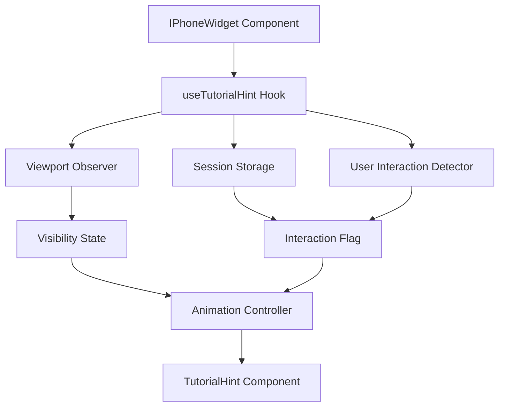

# Design Document

## Overview

The iPhone Widget Tutorial Hint is an animated visual guide that helps users discover the interactive nature of the iPhone widget component. It uses a hand cursor icon that demonstrates the interaction pattern: clicking on the About app and then clicking the back button to return to the home screen. The feature is viewport-aware, session-based, and respects user interactions to avoid being intrusive.

## Architecture

### Component Structure

```
iphone-widget/
├── IPhoneWidget.tsx (existing - will be enhanced)
├── components/
│   └── TutorialHint.tsx (new component)
├── hooks/
│   └── useTutorialHint.ts (new hook)
└── utils/
    └── sessionStorage.ts (existing - will be enhanced)
```

### Data Flow



## Components and Interfaces

### 1. TutorialHint Component

**Purpose:** Renders the animated hand cursor and manages the animation sequence.

**Props Interface:**

```typescript
interface TutorialHintProps {
  isVisible: boolean;
  targetPositions: {
    aboutApp: { x: number; y: number };
    backButton: { x: number; y: number };
  };
  onAnimationComplete: () => void;
}
```

**Responsibilities:**

- Render hand cursor icon (using lucide-react Hand icon or custom SVG)
- Animate cursor movement between positions
- Display clicking animation (scale effect)
- Handle animation timing and sequencing
- Respect prefers-reduced-motion

**Animation Sequence:**

1. **Phase 1: Appear** (0.5s)
   - Fade in at starting position (slightly offset from About app)
   - Scale from 0.8 to 1

2. **Phase 2: Move to About App** (1s)
   - Translate to About app position
   - Use cubic-bezier easing for natural movement

3. **Phase 3: Click About App** (0.4s)
   - Scale down to 0.9 (press)
   - Scale back to 1 (release)
   - Brief pause (0.2s)

4. **Phase 4: Wait for App Open** (0.5s)
   - Hold position while simulating app opening

5. **Phase 5: Move to Back Button** (1s)
   - Translate to back button position
   - Use cubic-bezier easing

6. **Phase 6: Click Back Button** (0.4s)
   - Scale down to 0.9 (press)
   - Scale back to 1 (release)
   - Brief pause (0.2s)

7. **Phase 7: Disappear** (0.5s)
   - Fade out
   - Scale to 0.8

**Total Animation Duration:** ~4.5 seconds

### 2. useTutorialHint Hook

**Purpose:** Manages tutorial hint state, viewport detection, and user interaction tracking.

**Interface:**

```typescript
interface UseTutorialHintReturn {
  shouldShowHint: boolean;
  targetPositions: {
    aboutApp: { x: number; y: number };
    backButton: { x: number; y: number };
  };
  handleAnimationComplete: () => void;
  handleUserInteraction: () => void;
}

function useTutorialHint(
  widgetRef: RefObject<HTMLElement>,
  isModalOpen: boolean
): UseTutorialHintReturn;
```

**Responsibilities:**

- Track viewport visibility using IntersectionObserver
- Check session storage for interaction flag
- Calculate target positions relative to widget
- Manage animation cycle timing (10-second intervals)
- Handle user interaction events
- Clean up timers and observers on unmount

**State Management:**

```typescript
const [isVisible, setIsVisible] = useState(false);
const [hasInteracted, setHasInteracted] = useState(false);
const [isInViewport, setIsInViewport] = useState(false);
const [animationCycle, setAnimationCycle] = useState(0);
```

### 3. Session Storage Enhancement

**Purpose:** Extend existing session storage utilities to support tutorial hint flag.

**New Storage Key:**

```typescript
const STORAGE_KEYS = {
  // Existing keys
  SPLASH_SHOWN: 'portfolio-splash-shown',
  // New key
  WIDGET_INTERACTED: 'iphone-widget-interacted',
} as const;
```

**New Utility Functions:**

```typescript
// Check if user has interacted with widget in current session
export function hasWidgetInteraction(): boolean {
  try {
    const value = sessionStorage.getItem(STORAGE_KEYS.WIDGET_INTERACTED);
    return value === 'true';
  } catch {
    return false;
  }
}

// Mark widget as interacted
export function setWidgetInteraction(): void {
  try {
    sessionStorage.setItem(STORAGE_KEYS.WIDGET_INTERACTED, 'true');
  } catch {
    // Fail silently
  }
}

// Clear widget interaction flag (for testing)
export function clearWidgetInteraction(): void {
  try {
    sessionStorage.removeItem(STORAGE_KEYS.WIDGET_INTERACTED);
  } catch {
    // Fail silently
  }
}
```

## Data Models

### Animation State

```typescript
type AnimationPhase =
  | 'idle'
  | 'appearing'
  | 'moving-to-about'
  | 'clicking-about'
  | 'waiting'
  | 'moving-to-back'
  | 'clicking-back'
  | 'disappearing';

interface AnimationState {
  phase: AnimationPhase;
  progress: number; // 0-1
  currentPosition: { x: number; y: number };
  isAnimating: boolean;
}
```

### Target Positions

```typescript
interface TargetPositions {
  aboutApp: {
    x: number; // Relative to widget container
    y: number; // Relative to widget container
  };
  backButton: {
    x: number;
    y: number;
  };
}
```

## Styling

### TutorialHint.module.css

```css
.tutorialHint {
  position: absolute;
  pointer-events: none;
  z-index: 100;
  will-change: transform, opacity;
  transition:
    opacity 0.5s ease,
    transform 0.5s ease;
}

.tutorialHint[aria-hidden='true'] {
  opacity: 0;
  transform: scale(0.8);
}

.handIcon {
  width: 48px;
  height: 48px;
  filter: drop-shadow(0 4px 12px rgba(0, 0, 0, 0.3));
  color: var(--color-primary);
}

/* Animation classes */
.appearing {
  animation: appear 0.5s cubic-bezier(0.34, 1.56, 0.64, 1);
}

.clicking {
  animation: click 0.4s cubic-bezier(0.34, 1.56, 0.64, 1);
}

.disappearing {
  animation: disappear 0.5s ease-out;
}

@keyframes appear {
  from {
    opacity: 0;
    transform: scale(0.8);
  }
  to {
    opacity: 1;
    transform: scale(1);
  }
}

@keyframes click {
  0%,
  100% {
    transform: scale(1);
  }
  50% {
    transform: scale(0.9);
  }
}

@keyframes disappear {
  from {
    opacity: 1;
    transform: scale(1);
  }
  to {
    opacity: 0;
    transform: scale(0.8);
  }
}

/* Respect reduced motion */
@media (prefers-reduced-motion: reduce) {
  .tutorialHint {
    animation: none !important;
    transition: none !important;
  }
}
```

## Integration Points

### 1. IPhoneWidget Component Enhancement

**Changes Required:**

```typescript
// Add ref for widget container
const widgetRef = useRef<HTMLDivElement>(null);

// Add tutorial hint hook
const {
  shouldShowHint,
  targetPositions,
  handleAnimationComplete,
  handleUserInteraction,
} = useTutorialHint(widgetRef, isModalOpen);

// Add click handler to widget
const handleWidgetClick = () => {
  handleUserInteraction();
  // Existing click logic...
};

// Render tutorial hint
return (
  <div ref={widgetRef} onClick={handleWidgetClick}>
    {/* Existing widget content */}

    {shouldShowHint && (
      <TutorialHint
        isVisible={shouldShowHint}
        targetPositions={targetPositions}
        onAnimationComplete={handleAnimationComplete}
      />
    )}
  </div>
);
```

### 2. Position Calculation

**Strategy:** Calculate positions based on widget dimensions and app icon layout.

```typescript
function calculateTargetPositions(widgetElement: HTMLElement): TargetPositions {
  const widgetRect = widgetElement.getBoundingClientRect();

  // About app is typically in first row, first column
  // Assuming 4-column grid with 16px gap
  const iconSize = 60;
  const gap = 16;
  const padding = 20;

  const aboutAppX = padding + iconSize / 2;
  const aboutAppY = padding + 100 + iconSize / 2; // Account for status bar

  // Back button is typically top-left in app view
  const backButtonX = padding + 20;
  const backButtonY = padding + 60;

  return {
    aboutApp: { x: aboutAppX, y: aboutAppY },
    backButton: { x: backButtonX, y: backButtonY },
  };
}
```

## Error Handling

### Session Storage Errors

```typescript
try {
  const hasInteracted = sessionStorage.getItem(STORAGE_KEYS.WIDGET_INTERACTED);
  // Use value
} catch (error) {
  console.warn('Session storage unavailable, tutorial hint disabled');
  // Gracefully disable feature
  return { shouldShowHint: false, ... };
}
```

### Viewport Observer Errors

```typescript
useEffect(() => {
  if (!widgetRef.current || !('IntersectionObserver' in window)) {
    // Browser doesn't support IntersectionObserver
    setIsInViewport(true); // Assume visible
    return;
  }

  const observer = new IntersectionObserver(
    (entries) => {
      entries.forEach((entry) => {
        setIsInViewport(entry.intersectionRatio >= 0.5);
      });
    },
    { threshold: 0.5 }
  );

  observer.observe(widgetRef.current);

  return () => observer.disconnect();
}, []);
```

## Performance Considerations

### 1. Animation Performance

- Use CSS transforms (translateX, translateY, scale) for GPU acceleration
- Avoid animating layout properties (width, height, top, left)
- Use `will-change: transform, opacity` sparingly
- Clean up `will-change` after animation completes

### 2. Timer Management

```typescript
useEffect(() => {
  if (!shouldShowHint || !isInViewport || hasInteracted) {
    return;
  }

  // Initial delay before first animation
  const initialTimer = setTimeout(() => {
    startAnimation();
  }, 2000);

  // Repeat timer for subsequent animations
  const repeatTimer = setInterval(() => {
    if (isInViewport && !hasInteracted) {
      startAnimation();
    }
  }, 10000);

  return () => {
    clearTimeout(initialTimer);
    clearInterval(repeatTimer);
  };
}, [shouldShowHint, isInViewport, hasInteracted]);
```

### 3. Event Listener Cleanup

```typescript
useEffect(() => {
  const handleClick = () => {
    handleUserInteraction();
  };

  const widgetElement = widgetRef.current;
  if (widgetElement) {
    widgetElement.addEventListener('click', handleClick);
  }

  return () => {
    if (widgetElement) {
      widgetElement.removeEventListener('click', handleClick);
    }
  };
}, []);
```

## Testing Strategy

### Unit Tests

1. **useTutorialHint Hook Tests**
   - Should return shouldShowHint=false when interaction flag is set
   - Should return shouldShowHint=false when widget is not in viewport
   - Should return shouldShowHint=false when modal is open
   - Should calculate correct target positions
   - Should handle session storage errors gracefully

2. **TutorialHint Component Tests**
   - Should render hand icon when visible
   - Should not render when not visible
   - Should call onAnimationComplete after animation sequence
   - Should respect prefers-reduced-motion

3. **Session Storage Utility Tests**
   - Should store and retrieve interaction flag
   - Should handle storage errors gracefully
   - Should clear flag correctly

### Integration Tests

1. **Viewport Visibility**
   - Tutorial hint should appear when widget is 50% visible
   - Tutorial hint should not appear when widget is less than 50% visible
   - Tutorial hint should pause when scrolled out of view

2. **User Interaction**
   - Tutorial hint should stop after first click on widget
   - Interaction flag should persist across page navigations in same session
   - Tutorial hint should reappear in new browser session

3. **Animation Cycle**
   - Animation should complete full sequence
   - Animation should repeat every 10 seconds
   - Animation should not start if user has interacted

### Manual Testing Checklist

- [ ] Tutorial hint appears after 2 seconds when widget is visible
- [ ] Hand cursor animates smoothly to About app
- [ ] Clicking animation is visible and clear
- [ ] Hand cursor moves to back button position
- [ ] Animation repeats every 10 seconds
- [ ] Clicking widget stops tutorial hint immediately
- [ ] Tutorial hint doesn't appear after interaction
- [ ] Tutorial hint reappears on new browser session
- [ ] Works correctly on mobile devices
- [ ] Respects prefers-reduced-motion setting
- [ ] Doesn't interfere with widget functionality
- [ ] Performs smoothly at 60fps

## Accessibility

### ARIA Attributes

```typescript
<div
  className={styles.tutorialHint}
  aria-hidden="true"
  role="presentation"
>
  <Hand className={styles.handIcon} />
</div>
```

### Reduced Motion Support

```typescript
const prefersReducedMotion = useMediaQuery('(prefers-reduced-motion: reduce)');

if (prefersReducedMotion) {
  // Disable animations, show static hint or skip entirely
  return null;
}
```

### Focus Management

- Tutorial hint should not trap or steal focus
- Tutorial hint should not interfere with keyboard navigation
- Tutorial hint should be completely ignored by screen readers

## Mobile Considerations

### Touch Detection

```typescript
useEffect(() => {
  const handleTouch = () => {
    handleUserInteraction();
  };

  const widgetElement = widgetRef.current;
  if (widgetElement) {
    widgetElement.addEventListener('touchstart', handleTouch);
  }

  return () => {
    if (widgetElement) {
      widgetElement.removeEventListener('touchstart', handleTouch);
    }
  };
}, []);
```

### Responsive Positioning

```typescript
function calculateTargetPositions(widgetElement: HTMLElement): TargetPositions {
  const widgetRect = widgetElement.getBoundingClientRect();
  const isMobile = widgetRect.width < 400;

  // Scale positions for mobile
  const scale = isMobile ? 0.8 : 1;

  return {
    aboutApp: {
      x: aboutAppX * scale,
      y: aboutAppY * scale,
    },
    backButton: {
      x: backButtonX * scale,
      y: backButtonY * scale,
    },
  };
}
```

## Future Enhancements

1. **Customizable Animation Speed**
   - Allow configuration of animation duration
   - Support for different easing functions

2. **Multiple Tutorial Hints**
   - Support for different hint sequences
   - Progressive disclosure of features

3. **Analytics Integration**
   - Track how many users see the hint
   - Track how many users interact after seeing hint
   - A/B test different hint styles

4. **Localization**
   - Support for different hand cursor styles
   - RTL layout support

5. **Advanced Animations**
   - Particle effects on click
   - Ripple effect from cursor
   - Sound effects (optional)
