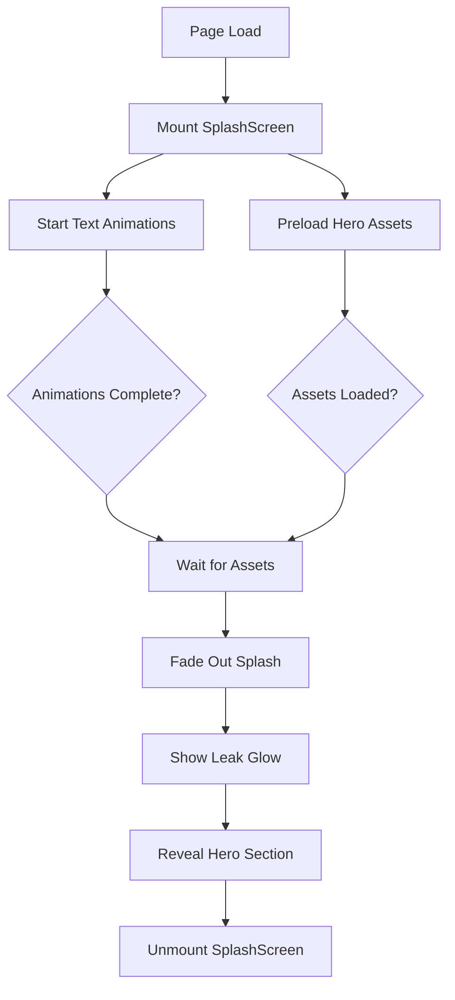

# Design Document

## Overview

The splash screen and hero transition feature creates a cinematic loading experience that displays while the hero section assets (ThreeScene 3D content and text overlays) are being loaded. The splash screen features animated text with the Rubik Glitch font, followed by a smooth transition to the fully-loaded hero section.

### Key Design Principles

1. **Seamless Experience**: No jarring transitions or loading artifacts
2. **Performance-First**: Preload assets during splash animation
3. **Accessibility**: Support reduced motion preferences
4. **Minimal Overhead**: Lightweight component that doesn't impact bundle size
5. **Reusability**: Standalone component that can be easily maintained

## Architecture

### Component Hierarchy

```
App Layout (layout.tsx)
├── SplashScreen (new) - Outside LayoutWrapper, covers everything
│   └── Splash Animation
└── LayoutWrapper
    ├── Navigation (loaded but hidden during splash)
    └── Home Page (page.tsx)
        └── Hero Section (loaded but hidden during splash)
            ├── ThreeScene
            └── Hero Content
```

**Critical**: The splash screen must be rendered OUTSIDE the LayoutWrapper to cover all content including navigation. The navigation and hero section are loaded and ready, but visually hidden by the splash overlay until the transition completes.

### State Management

The splash screen will manage its own internal state without requiring global state management:

- **Animation Phase**: Track current animation step (text-in, hold, text-out, glow, hero-reveal)
- **Loading State**: Track hero section asset loading status
- **Visibility State**: Control when to show/hide splash and hero sections

### Data Flow



## Components and Interfaces

### SplashScreen Component

**Location**: `src/components/splash/SplashScreen.tsx`

**Props Interface**:

```typescript
interface SplashScreenProps {
  // No props needed - self-contained component
}
```

**Internal State**:

```typescript
interface SplashState {
  phase: 'text-in' | 'hold' | 'text-out' | 'glow' | 'complete';
  heroAssetsLoaded: boolean;
  isVisible: boolean;
}
```

**Key Methods**:

- `startTextAnimations()`: Initiates the text animation sequence
- `handleAssetsLoaded()`: Callback when hero assets finish loading
- `transitionToHero()`: Triggers fade-out and removes splash from DOM
- `cleanup()`: Clears timers and event listeners

**Behavior**:

1. Renders as fixed overlay covering entire viewport
2. Displays animated text sequence
3. Monitors hero asset loading in background
4. Fades out when both animations complete AND assets are loaded
5. Removes itself from DOM after fade-out completes
6. Does NOT interfere with navigation or layout logic

### Animation Timeline Controller

**Location**: `src/components/splash/AnimationTimeline.ts`

**Purpose**: Manages the precise timing of all animation phases

```typescript
class AnimationTimeline {
  private timers: number[] = [];
  private reducedMotion: boolean;

  constructor(reducedMotion: boolean) {
    this.reducedMotion = reducedMotion;
  }

  schedule(callback: () => void, delay: number): void;
  clear(): void;
  getDuration(): number;
}
```

**Timeline Configuration**:

```typescript
const TIMELINE = {
  ASSEMBLING_IN: { start: 0, duration: 500 },
  TECHNICAL_STACK_IN: { start: 500, duration: 700 },
  COMPILING_IN: { start: 1000, duration: 500 },
  HOLD: { start: 1500, duration: 300 },
  FADE_OUT: { start: 1800, duration: 500 },
  LEAK_GLOW: { start: 2100, duration: 300 },
  HERO_REVEAL: { start: 2300, duration: 700 },
  TOTAL: 3000,
};

const TIMELINE_REDUCED_MOTION = {
  ASSEMBLING_IN: { start: 0, duration: 100 },
  TECHNICAL_STACK_IN: { start: 100, duration: 100 },
  COMPILING_IN: { start: 200, duration: 100 },
  HOLD: { start: 300, duration: 100 },
  FADE_OUT: { start: 400, duration: 100 },
  LEAK_GLOW: { start: 500, duration: 100 },
  HERO_REVEAL: { start: 600, duration: 100 },
  TOTAL: 700,
};
```

### Asset Preloader Hook

**Location**: `src/hooks/useHeroPreload.ts`

**Purpose**: Preload hero section assets during splash animation

```typescript
interface PreloadStatus {
  threeSceneReady: boolean;
  texturesLoaded: boolean;
  fontsLoaded: boolean;
  isComplete: boolean;
}

function useHeroPreload(): PreloadStatus {
  const [status, setStatus] = useState<PreloadStatus>({
    threeSceneReady: false,
    texturesLoaded: false,
    fontsLoaded: false,
    isComplete: false,
  });

  useEffect(() => {
    // Preload Three.js assets
    // Preload icon atlas texture
    // Check font loading
  }, []);

  return status;
}
```

## Data Models

### Animation Phase State Machine

```typescript
type AnimationPhase =
  | 'text-in' // Text elements animating in
  | 'hold' // Static display
  | 'text-out' // Text fading out
  | 'glow' // Leak motion glow effect
  | 'hero-reveal' // Hero section appearing
  | 'complete'; // Splash unmounted

interface PhaseTransition {
  from: AnimationPhase;
  to: AnimationPhase;
  condition: () => boolean;
  duration: number;
}
```

### Text Animation Configuration

```typescript
interface TextAnimationConfig {
  text: string;
  delay: number;
  duration: number;
  direction: 'left' | 'right' | 'up';
  opacity: number;
  fontSize: string;
  fontFamily: string;
  fontStyle?: 'normal' | 'italic';
}

const TEXT_ANIMATIONS: TextAnimationConfig[] = [
  {
    text: 'Assembling',
    delay: 0,
    duration: 500,
    direction: 'left',
    opacity: 1,
    fontSize: '3rem',
    fontFamily: "'Rubik Glitch', cursive",
    fontStyle: 'normal',
  },
  {
    text: 'Technical Stack',
    delay: 500,
    duration: 700,
    direction: 'right',
    opacity: 1,
    fontSize: '3rem',
    fontFamily: "'Rubik Glitch', cursive",
    fontStyle: 'normal',
  },
  {
    text: 'Compiling innovation...',
    delay: 1000,
    duration: 500,
    direction: 'up',
    opacity: 0.6,
    fontSize: '1.2rem',
    fontFamily: 'var(--font-ibm-plex-sans)',
    fontStyle: 'italic',
  },
];
```

## Styling Architecture

### CSS Modules Structure

**File**: `src/components/splash/SplashScreen.module.css`

**Key Classes**:

```css
.splashContainer {
  /* Full viewport overlay - covers everything including navigation */
  position: fixed;
  top: 0;
  left: 0;
  width: 100vw;
  height: 100vh;
  z-index: 9999; /* Above all content */
  background: #171717; /* Match ThreeScene background */
  display: flex;
  align-items: center;
  justify-content: center;
  flex-direction: column;
  pointer-events: auto; /* Block all interactions during splash */
  transition: opacity 0.5s cubic-bezier(0.4, 0, 0.2, 1);
}

.splashContainer.fadeOut {
  opacity: 0;
  pointer-events: none; /* Allow interactions after fade starts */
}

.textContainer {
  /* Center text elements */
  display: flex;
  flex-direction: column;
  align-items: center;
  gap: 1rem;
}

.mainText {
  /* Rubik Glitch font styling */
  font-family: 'Rubik Glitch', cursive;
  font-size: 3rem;
  font-weight: 700;
  color: rgba(255, 255, 255, 0.9);
  text-align: center;
  line-height: 1.2;
}

.subText {
  /* Italic subtext */
  font-family: var(--font-ibm-plex-sans);
  font-size: 1.2rem;
  font-style: italic;
  color: rgba(255, 255, 255, 0.6);
  text-align: center;
}

.leakGlow {
  /* Horizontal light streak */
  position: absolute;
  top: 50%;
  left: 50%;
  transform: translate(-50%, -50%);
  width: 2px;
  height: 2px;
  background: radial-gradient(
    ellipse,
    rgba(186, 255, 233, 0.8) 0%,
    rgba(186, 255, 233, 0.4) 50%,
    transparent 100%
  );
  filter: blur(20px);
}

/* Animation classes */
.slideInLeft {
  animation: slideInLeft 0.5s cubic-bezier(0.4, 0, 0.2, 1) forwards;
}

.slideInRight {
  animation: slideInRight 0.7s cubic-bezier(0.4, 0, 0.2, 1) forwards;
}

.slideInUp {
  animation: slideInUp 0.5s cubic-bezier(0.4, 0, 0.2, 1) forwards;
}

.fadeOut {
  animation: fadeOut 0.5s cubic-bezier(0.4, 0, 0.2, 1) forwards;
}

.glowExpand {
  animation: glowExpand 0.3s cubic-bezier(0.4, 0, 0.2, 1) forwards;
}

.heroReveal {
  animation: heroReveal 0.7s cubic-bezier(0.4, 0, 0.2, 1) forwards;
}
```

### Animation Keyframes

```css
@keyframes slideInLeft {
  from {
    opacity: 0;
    transform: translateX(-30px);
  }
  to {
    opacity: 1;
    transform: translateX(0);
  }
}

@keyframes slideInRight {
  from {
    opacity: 0;
    transform: translateX(30px);
  }
  to {
    opacity: 1;
    transform: translateX(0);
  }
}

@keyframes slideInUp {
  from {
    opacity: 0;
    transform: translateY(10px);
  }
  to {
    opacity: 0.6;
    transform: translateY(0);
  }
}

@keyframes fadeOut {
  from {
    opacity: 1;
    transform: translateY(0) scale(1);
  }
  to {
    opacity: 0;
    transform: translateY(-40px) scale(0.95);
  }
}

@keyframes glowExpand {
  from {
    width: 2px;
    height: 2px;
    opacity: 0;
  }
  to {
    width: 100vw;
    height: 4px;
    opacity: 1;
  }
}

@keyframes heroReveal {
  from {
    opacity: 0;
    transform: translateY(60px);
  }
  to {
    opacity: 1;
    transform: translateY(0);
  }
}

/* Reduced motion support */
@media (prefers-reduced-motion: reduce) {
  .slideInLeft,
  .slideInRight,
  .slideInUp,
  .fadeOut,
  .glowExpand,
  .heroReveal {
    animation-duration: 0.1s;
  }

  @keyframes slideInLeft,
  @keyframes slideInRight,
  @keyframes slideInUp {
    from {
      opacity: 0;
      transform: none;
    }
    to {
      opacity: 1;
      transform: none;
    }
  }

  @keyframes fadeOut {
    from {
      opacity: 1;
    }
    to {
      opacity: 0;
    }
  }
}
```

## Error Handling

### Asset Loading Failures

**Strategy**: Graceful degradation

1. **Timeout Mechanism**: If assets don't load within 5 seconds, proceed with transition
2. **Fallback State**: Show hero section even if some assets aren't ready
3. **Error Logging**: Log failures to console for debugging

```typescript
const ASSET_LOAD_TIMEOUT = 5000;

useEffect(() => {
  const timeout = setTimeout(() => {
    if (!heroAssetsLoaded) {
      console.warn('Hero assets loading timeout, proceeding with transition');
      setHeroAssetsLoaded(true);
    }
  }, ASSET_LOAD_TIMEOUT);

  return () => clearTimeout(timeout);
}, [heroAssetsLoaded]);
```

### Animation Timing Issues

**Strategy**: Defensive programming

1. **Timer Cleanup**: Always clear timers on unmount
2. **State Guards**: Check component mounted state before setState
3. **Fallback Timing**: Use requestAnimationFrame for critical timing

```typescript
useEffect(() => {
  let mounted = true;

  const animate = () => {
    if (!mounted) return;
    // Animation logic
  };

  return () => {
    mounted = false;
  };
}, []);
```

### Font Loading Failures

**Strategy**: System font fallback

```css
.mainText {
  font-family: 'Rubik Glitch', 'Courier New', monospace;
}

.subText {
  font-family:
    var(--font-ibm-plex-sans),
    -apple-system,
    BlinkMacSystemFont,
    'Segoe UI',
    sans-serif;
}
```

## Testing Strategy

### Unit Tests

**File**: `src/components/splash/__tests__/SplashScreen.test.tsx`

**Test Cases**:

1. **Rendering**
   - Renders splash screen on mount
   - Displays all text elements in sequence
   - Applies correct CSS classes

2. **Animation Timing**
   - Text animations trigger at correct times
   - Hold phase duration is accurate
   - Fade-out starts after hold completes

3. **Asset Preloading**
   - Preload hook is called on mount
   - Transition waits for assets to load
   - Timeout mechanism works correctly

4. **Reduced Motion**
   - Detects prefers-reduced-motion setting
   - Uses shorter animation durations
   - Removes transform animations

5. **Cleanup**
   - Timers are cleared on unmount
   - Event listeners are removed
   - No memory leaks

### Integration Tests

**File**: `src/components/splash/__tests__/SplashScreen.integration.test.tsx`

**Test Cases**:

1. **Full Sequence**
   - Complete splash-to-hero transition
   - Hero section renders after splash
   - No visual artifacts during transition

2. **Asset Loading**
   - ThreeScene loads during splash
   - Icon atlas texture loads correctly
   - Fonts are available before display

3. **User Interactions**
   - Clicking during splash doesn't break animation
   - Keyboard navigation is disabled during splash
   - Focus management after transition

### Visual Regression Tests

**Tool**: Playwright or Chromatic

**Test Cases**:

1. Splash screen initial state
2. Each animation phase
3. Leak glow effect
4. Hero reveal transition
5. Reduced motion variant

### Performance Tests

**Metrics to Track**:

1. **Time to Interactive (TTI)**: Should not exceed 3.5 seconds
2. **First Contentful Paint (FCP)**: Splash should appear within 500ms
3. **Animation Frame Rate**: Maintain 60fps during animations
4. **Memory Usage**: No memory leaks after unmount

**Tools**:

- Chrome DevTools Performance tab
- Lighthouse CI
- React DevTools Profiler

## Accessibility Considerations

### Keyboard Navigation

- Splash screen should not trap focus
- Skip link should be available (hidden during splash)
- Hero section should be keyboard-accessible after transition

### Screen Readers

```tsx
<div
  role="status"
  aria-live="polite"
  aria-label="Loading application"
  className={styles.splashContainer}
>
  <div aria-hidden="true" className={styles.textContainer}>
    {/* Visual text elements */}
  </div>
  <span className="sr-only">
    Assembling Technical Stack. Compiling innovation. Please wait.
  </span>
</div>
```

### Reduced Motion

- Respect `prefers-reduced-motion` media query
- Reduce animation duration to 0.1s
- Remove transform animations
- Keep fade transitions only

### Color Contrast

- Text opacity should meet WCAG AA standards
- Main text: rgba(255, 255, 255, 0.9) - contrast ratio 15.3:1
- Subtext: rgba(255, 255, 255, 0.6) - contrast ratio 8.6:1

## Performance Optimization

### Code Splitting

```tsx
// Lazy load splash screen to reduce initial bundle
const SplashScreen = dynamic(() => import('@/components/splash/SplashScreen'), {
  ssr: false,
});
```

### Asset Preloading Strategy

1. **Critical Assets First**:
   - Rubik Glitch font (preload in head)
   - ThreeScene geometry data
   - Icon atlas texture

2. **Progressive Loading**:
   - Load low-res textures first
   - Upgrade to high-res during splash
   - Defer non-critical assets

3. **Caching**:
   - Use service worker for font caching
   - Cache icon atlas in localStorage
   - Implement stale-while-revalidate strategy

### Animation Performance

1. **GPU Acceleration**:
   - Use `transform` and `opacity` only
   - Apply `will-change` sparingly
   - Remove `will-change` after animation

2. **Composite Layers**:
   - Isolate animated elements
   - Use `transform: translateZ(0)` for layer promotion
   - Minimize layer count

3. **Frame Budget**:
   - Target 60fps (16.67ms per frame)
   - Use `requestAnimationFrame` for timing
   - Batch DOM updates

## Integration Points

### Page Component Integration

**File**: `src/app/page.tsx`

```tsx
'use client';

import { useState } from 'react';
import dynamic from 'next/dynamic';
import { SplashScreen } from '@/components/splash/SplashScreen';
import { HeroSection } from '@/components/sections/hero/HeroSection';

const ProjectsSection = dynamic(/* ... */);
const AboutSection = dynamic(/* ... */);
const ContactSection = dynamic(/* ... */);

export default function Home() {
  // No splash logic needed in page component
  // Splash is handled at layout level
  return (
    <>
      <HeroSection />
      <AboutSection />
      <ProjectsSection />
      <ContactSection />
    </>
  );
}
```

**Note**: The page component remains simple. All splash logic is handled at the layout level.

### Layout Integration

**File**: `src/app/layout.tsx`

The splash screen must be integrated OUTSIDE the LayoutWrapper to cover all content:

```tsx
export default function RootLayout({
  children,
}: {
  children: React.ReactNode;
}) {
  return (
    <html lang="en" className={ibmPlexSans.variable} suppressHydrationWarning>
      <head>
        {/* Add Rubik Glitch font preload */}
        <link rel="preconnect" href="https://fonts.googleapis.com" />
        <link
          rel="preconnect"
          href="https://fonts.gstatic.com"
          crossOrigin="anonymous"
        />
        <link
          href="https://fonts.googleapis.com/css2?family=Rubik+Glitch&display=swap"
          rel="stylesheet"
        />
        {/* ... existing head content ... */}
      </head>
      <body className={ibmPlexSans.className} suppressHydrationWarning>
        <StructuredData type="person" />
        <ThemeProvider>
          <ChakraProvider>
            <NavigationProvider>
              {/* Splash screen OUTSIDE LayoutWrapper - covers everything */}
              <SplashScreen />

              {/* LayoutWrapper with navigation and content - loads normally */}
              <LayoutWrapper>{children}</LayoutWrapper>
            </NavigationProvider>
          </ChakraProvider>
        </ThemeProvider>
      </body>
    </html>
  );
}
```

**Critical Implementation Details**:

1. **SplashScreen Position**: Rendered as a sibling to LayoutWrapper, not inside it
2. **Fixed Overlay**: Uses `position: fixed` with `z-index: 9999` to cover everything
3. **No Layout Disruption**: Navigation and hero content load normally behind splash
4. **No Blinking**: Content is already loaded when splash fades out
5. **Smooth Transition**: Splash opacity animates from 1 to 0, revealing loaded content

### ThreeScene Integration

**Modification**: `src/components/sections/hero/ThreeScene.tsx`

Add callback for asset loading completion:

```tsx
interface ThreeSceneProps {
  theme: 'light' | 'dark';
  isVisible: boolean;
  onAssetsLoaded?: () => void; // New prop
}

export const ThreeScene: React.FC<ThreeSceneProps> = ({
  theme,
  isVisible,
  onAssetsLoaded,
}) => {
  useEffect(() => {
    if (atlas && isMounted && hasWebGL) {
      onAssetsLoaded?.();
    }
  }, [atlas, isMounted, hasWebGL, onAssetsLoaded]);

  // ... rest of component
};
```

## Design Decisions and Rationales

### Decision 1: Fixed 3-Second Duration

**Rationale**:

- Long enough to preload assets
- Short enough to not frustrate users
- Industry standard for splash screens
- Allows for smooth, unhurried animations

**Alternative Considered**: Variable duration based on asset loading
**Why Rejected**: Unpredictable UX, could be too long on slow connections

### Decision 2: Rubik Glitch Font

**Rationale**:

- Matches "technical stack" theme
- Distinctive and memorable
- Good readability at large sizes
- Available via Google Fonts (easy integration)

**Alternative Considered**: Custom animated SVG text
**Why Rejected**: Larger bundle size, more complex implementation

### Decision 3: Leak Motion Glow Effect

**Rationale**:

- Signals completion of loading process
- Creates visual continuity between splash and hero
- Adds cinematic quality
- Minimal performance impact

**Alternative Considered**: Fade-to-black transition
**Why Rejected**: Less engaging, doesn't convey "completion" feeling

### Decision 4: Preload During Splash

**Rationale**:

- Maximizes perceived performance
- Ensures smooth hero section reveal
- No loading artifacts visible to user
- Better Core Web Vitals scores

**Alternative Considered**: Load hero after splash completes
**Why Rejected**: Would cause visible loading delay after splash

### Decision 5: Component-Level State Management

**Rationale**:

- Splash is temporary, doesn't need global state
- Simpler implementation
- Easier to test in isolation
- No Redux/Context overhead

**Alternative Considered**: Global loading state in Context
**Why Rejected**: Unnecessary complexity for one-time use

### Decision 6: Splash Outside LayoutWrapper

**Rationale**:

- Covers all content including navigation
- No layout disruption or blinking
- Navigation loads normally but stays hidden
- Clean separation of concerns
- Splash can be removed from DOM without affecting layout

**Alternative Considered**: Splash inside page component
**Why Rejected**: Would not cover navigation, causing visual inconsistency

## Mobile Considerations

### Responsive Design

**Breakpoints**:

- Desktop: 769px and above
- Mobile: 768px and below

**Mobile Adjustments**:

```css
@media (max-width: 768px) {
  .mainText {
    font-size: 2rem; /* Reduced from 3rem */
  }

  .subText {
    font-size: 1rem; /* Reduced from 1.2rem */
  }

  .textContainer {
    padding: 0 1rem; /* Add horizontal padding */
  }
}
```

### Touch Interactions

- Disable touch events during splash
- Prevent scroll during splash animation
- Re-enable interactions after hero reveal

```tsx
useEffect(() => {
  if (!splashComplete) {
    document.body.style.overflow = 'hidden';
    document.body.style.touchAction = 'none';
  } else {
    document.body.style.overflow = '';
    document.body.style.touchAction = '';
  }
}, [splashComplete]);
```

### Performance on Mobile Devices

- Reduce particle count in ThreeScene on mobile
- Use lower-resolution textures on mobile
- Simplify animations on low-end devices

```tsx
const isMobile = window.innerWidth <= 768;
const isLowEnd = navigator.hardwareConcurrency <= 4;

if (isMobile || isLowEnd) {
  // Use simplified animations
  TIMELINE = TIMELINE_REDUCED_MOTION;
}
```

## Future Enhancements

### Phase 2 Considerations

1. **Skip Button**: Allow users to skip splash after first visit
2. **Progress Indicator**: Show loading progress bar
3. **Dynamic Text**: Customize splash text based on time of day
4. **Sound Effects**: Optional audio feedback for animations
5. **Analytics**: Track splash completion rate and timing

### Extensibility

The component should be designed to easily support:

- Custom text content via props
- Configurable animation timing
- Alternative transition effects
- Different font choices
- Theme-aware colors
